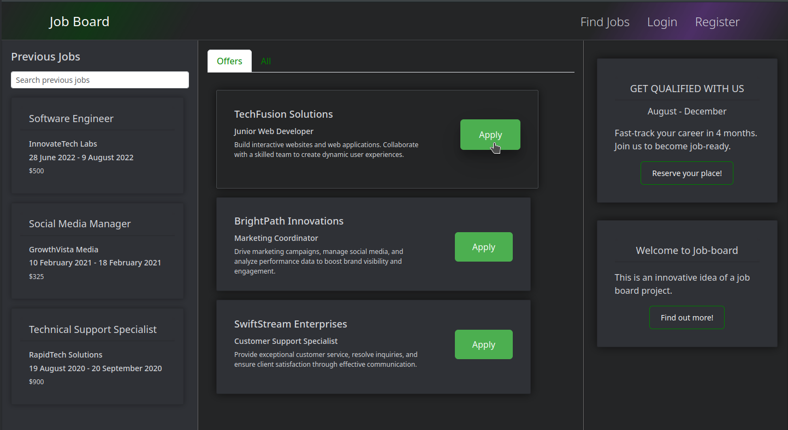
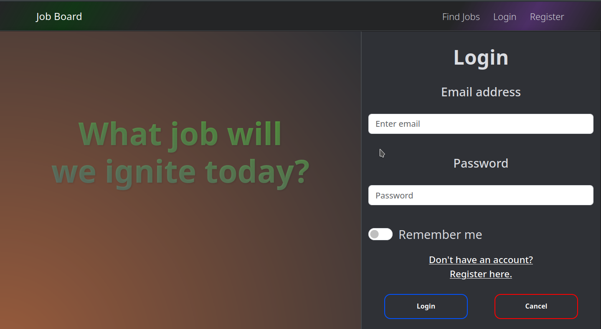

# Job Board Frontend

An interface for a job board. Currently under development. It s meant to be used with the job board api I also created ( link to repoository : https://github.com/Hwkz0/Job-Board-BackEnd )
I'm using react, axios, bootstrap, react-router-dom and I will probably add more until end of development. 

## Screenshots

## Table of Contents

- [Installation](#installation)
- [Usage](#usage)
- [Contributing](#contributing)
- [License](#license)

## Installation

1. Clone the repository: `git clone https://github.com/Hwkz0/Job-Board-FrontEnd`
2. Navigate to the project directory: `cd Job-Board-FrontEnd`
3. Install dependencies: `npm install |  npm install react-router-dom | npm install axios | npm install react-bootstrap bootstrap`

## Usage

1. Start the development server: `npm start`
2. Open your browser and navigate to `http://localhost:3000` to see the app in action.

## Contributing

Contributions are welcome! Please open an issue or submit a pull request.

## License

This project is licensed under the [MIT License](LICENSE).

